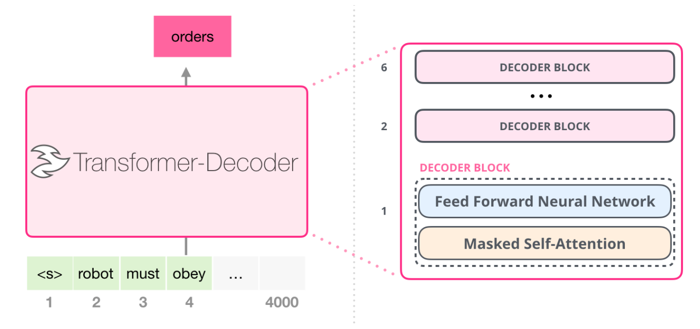

# ECE408/CS483 Final Project - GPT-2

## GPT-2

[GPT-2](https://github.com/openai/gpt-2) (Generative Pretrained Transformer 2) is a transformer-based language model developed by OpenAI, released in 2019. GPT-2 is based on transformers, which was first introduced in the paper [Attention is All You Need](https://arxiv.org/pdf/1706.03762). It is one of the first large-scale models to showcase the power of unsupervised learning for natural language generation tasks. GPT-2 is one of the works that marked the point of scaling law, where scale (i.e., model size, data size, and computational resources) was identified as a critical factor in performance. In addition, GPT-2 is part of a lineage of models that leverage transformer architecture, focusing on autoregressive generation, meaning it predicts the next word in a sequence given all the previous words using a decoder-only architecture. This paradigm are proved to be scalable and adopted in later widely used works including chatGPT and others. Therefore, hardware optimization and acceleration based on GPT-2 or other decoder-only transformers has become an crucial topic in parallel programming application. 

Because of the significance of GPT-2 and its relatively manageable model size, you are tasked with using cuda to accelerate GPT-2's forward pass in the training/inference process.

### GPT-2 Architecture
Below is a brief introduction to the overall architecture of GPT-2. Note that you do not need to understand all the details of GPT to complete this project, but gaining a better and more detailed understanding of the algorithms used will certainly help you with this project. 

#### Transformer Decoder Architecture
Similar to [Transformer-Decoder](https://arxiv.org/abs/1801.10198) as shown in Figure below , GPT-2 is composed of stacked transformer decoder layers. Each decoder block contains Multi-Head Self-Attention, Feed-Forward Network (FFN) and Layer Normalization and Residual Connections. GPT-2's full model consists of 48 transformer layers (blocks) for the 1.5 billion parameter version. 
<!-- These layers are stacked on top of each other to create a deep network capable of capturing complex dependencies and linguistic features. In this project, we use . -->

#### Multi-Head Self-Attention Mechanism
GPT-2 uses Multi-Head self-attention to attend to all previous tokens in the sequence to predict the next token. The model processes the input sequence and computes attention scores for each token, based on its relationships with the other tokens in the sequence. In multi-head self-attention, we perform the self-attention mechanism `h` times, where each head learns its own set of WQ(h), WK(h), and WV(h) weight matrices.

For each head `h`, the attention is computed independently:

head_h = softmax(Qh * Kh T / sqrt(dk)) * Vh

Where:
- Qh = X * WQ(h)
- Kh = X * WK(h)
- Vh = X * WV(h)

After computing attention for all heads, the outputs of each head are concatenated:

MultiHead(Q, K, V) = Concat(head1, head2, ..., headh) * WO

#### Feed-Forward Network (FFN) 
After the self-attention operation, the output is passed through a feed-forward network, consisting of two linear transformations with a GeLU activation in between.

#### Layer Normalization and Residual Connections
Like other transformer-based models, GPT-2 uses residual connections and layer normalization to stabilize and improve the learning process.

#### Causal Masking
GPT-2 uses causal masking in its self-attention mechanism. This ensures that when predicting the next token, the model only attends to the tokens that have come before it and does not look ahead. This masking enforces the autoregressive property, allowing GPT-2 to predict the next word in sequence rather than processing all tokens simultaneously. Pay attention to this in the softmax implementation.

#### Encoder
GPT-2 uses a decoder-only architecture. It does not have a learnable encoder network model. The encoder in the kernels simple transforms the word into embeddings.

## Project Overview

For this project, you will only need to write the forward pass cuda kernels in the `kernels` folder.

Note that for each kernel you need to implement (marked with `// Implement this`), we have provided you with a reference code, you can find them in the `cpu_kernels` folder. These implementations do not make use of the GPU. Your job is to utilize your parallel programming knowledge to rewrite the kernels so that they take full advantage of the GPU.

Below is a brief overview of the key files in the project:

 - encoder_forward: Converts the model's input data into a compact, meaningful representation for the processing in the model's forward pass.
 - layernorm_forward: Helps stabilize the outputs of the model. This keeps the outputs well-scaled, which is crucial for maintaining consistent behavior in the model.
 - matmul_forward: Performs matrix multiplication to transform inputs using learned weights.
 - attention_forward: Assigns dynamic weights to different parts of the input, allowing the model to focus on relevant information for better understanding.
 - residual_forward: Helps to preserve information from previous layers while adding new information from subsequent layers.
 - gelu_forward: Introduces non-linearity into the model, allowing it to capture more complex patterns and make creative inferences.
 - gpt2.cu: This is the main file where the full forward pass of the GPT-2 model is implemented. The main function in this file calls the forward pass functions and performs other necessary operations to run the model for inference. You do not have to modify anything in this file. It is provided for you to understand how the kernels you implement will be used.

## Grading

Project grading is tentatively determined as below for FA24:

- Convolution-M1: 20%
- GPT-M1: 40%
- GPT-M2: 20%
- Report: 10%
- Final Presentation: 10%
- Extra Credit: uncapped
  - Reporting bugs in the released project
  - Any findings/results deemed extraordinary based on the work you've done in this project

**Important:**
 - You and your teammates are required to attend weekly meetings with course staff to discuss your progress. You will be asked to present your progress and discuss any issues you have encountered. Meeting times will be determined based on the group's and their assigned TA/CA's availability, but you can expect them to last around 30 minutes.
 - We expect you to make consistent and frequent pushes to your repository. **Even when you do not make significant progress or encounter challenges, you should still push your code to the repository *DAILY*.** This will help us understand your progress and provide feedback.
 - Consider that you are working in a start-up. Keep your assigned TA/CA, who will be your manager, informed about your progress, challenges, and plans. Make sure to comment on your code, so that your teammates and the TA/CA can easily understand it and so you can deepen your own understanding.

## Notes on Teamwork

In this project, you and your teammates will work, present, and be graded as a team. This means that all members share responsibility for the final outcome and are expected to contribute meaningfully to the project. It is essential that you always actively communicate with each other about your individual progress, challenges, and plans about the project. This is especially important given the required weekly meetings, as every group member can affect your grade in these meeting sessions. 

Active communication will help address issues early, keep everyone aligned, and ensure consistent progress. We recommend establishing some kind of regular check-in meetings within your group in addition to the meetings with course staff.

Reach out to your TA/CA as soon as possible if challenges arise within your team.

## Academic Integrity
As this project is part of the coursework at UIUC, it is essential to adhere to the University's academic integrity policies. Please refrain from using external sources, repositories, or unauthorized online materials to complete your work. The use of code or solutions found online is strictly prohibited unless explicitly permitted by the course staff. You are encouraged to collaborate with your assigned teammates but avoid working with others outside your team.

Violations of academic integrity, including plagiarism or unauthorized collaboration, will be taken seriously and may result in disciplinary actions, including failure of the course or more severe consequences.

Please refer to the [University of Illinois Academic Integrity Policy](https://studentcode.illinois.edu/) for more details.